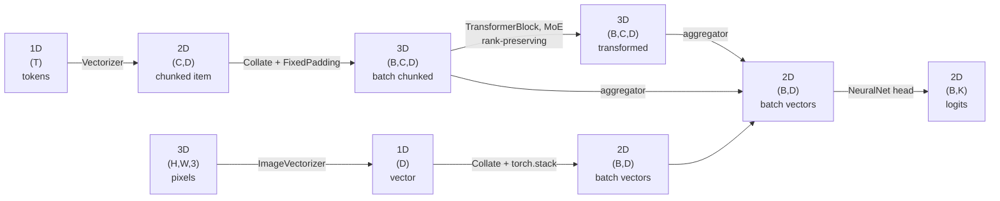

# 1. Core concepts

## 1.1 Embed once, reuse many times

Running a large pretrained encoder is expensive. Running it *again* for every experiment, every
epoch, and every colleague who wants to try something is wasteful — you are recomputing the same
vectors over and over to answer questions that have nothing to do with the encoder.

VectorMesh splits the problem at that seam:

1. **Encoding** — a frozen pretrained model turns raw data into vectors. Expensive, needs the
   hardware, done **once**, result written to disk with its metadata.
2. **Heading** — a small trainable network learns the task *on top of* those vectors. Cheap,
   done hundreds of times, runs fine on a laptop CPU.

The economics of that split are the whole point. Whoever has the GPU time and the knowledge to
choose an encoder runs step 1 and publishes a `VectorCache`. Everyone else — teammates,
downstream projects, a colleague prototyping a new label set, a student on a laptop — works
against that artefact and iterates in seconds instead of hours.

This generalises well beyond a classroom. It is the standard *linear probe* / *frozen feature*
setup used to evaluate representation quality, and it is how plenty of production systems
actually ship: one embedding job, many models trained against its output. A cache is a
deliverable in its own right. Treat it like one — version it, document it, hand it over.

Nothing about this locks you out of step 1. When you have the compute and a reason, you build
your own cache: pick a different encoder, a different context size, a different feature
extractor, and publish that. The point is that the two steps have *separate* cost profiles and
should have separate lifecycles — not that one of them is off-limits.

## 1.2 The skill: thinking at the vector level

The habit this library is built to break is treating a model as `input → blackbox → output`.

Once the encoder is frozen and the vectors are on disk, that framing stops being useful. What
you have is a **space of tensors** and a set of operations over them:

- you can have **several** representations of the same item — a dense embedding, a second
  encoder's embedding, a hand-written binary feature vector, an image embedding;
- you can **reduce** them (aggregate a chunk axis away), **fuse** them (concatenate, stack),
  **route** between them (gate, mix experts), and **transform** them (project, attend);
- and you can do all of that *before* anything resembling a classifier appears.

So the design questions become concrete and local: *at which rank do I fuse these two streams —
per chunk, or per document? Do I reduce before or after transforming? Is this gate worth its
parameters?* Those are questions about tensors, and you can answer each one with a training run
that takes a minute.

That is what to internalise: **most of the interesting design space lives between the vectors
and the loss**, and it is reachable without touching the encoder. The components in this library
are deliberately small so that recombining them is the cheap operation.

## 1.3 The tensor-flow ladder

Everything in VectorMesh is a move between four shapes. Learn these four and the type errors
stop being mysterious.

### Notation used throughout these docs

| Rank | Shape | Name used here | Lives where |
|:---:|---|---|---|
| **1D** | `(D)` | *vector* | one item, one representation |
| **2D** | `(C, D)` | *chunked item* | one item, split into `C` chunks — inside the cache |
| **2D** | `(B, D)` | *batch of vectors* | after collation, or after aggregation |
| **3D** | `(B, C, D)` | *batch of chunked items* | after collation with a padder |

`B` = batch, `C` = chunks, `D` = feature dimension, `T` = tokens, `K` = classes.

Note the deliberate collision: **two different things are rank 2**. `(C, D)` is one document;
`(B, D)` is a whole batch. Which one you are holding depends on whether you are before or after
collation. Keeping that straight is most of the battle, and it is exactly what the
`chunk_sizes` / `tensordtype` fields in the cache metadata tell you.

### The flow



### The same thing as a table

| Stage | Text | Image / regex | Done by |
|---|---|---|---|
| raw input | **1D** `(T)` tokens | **3D** `(H, W, 3)` pixels | tokenizer / image processor |
| vectorized, per item | **2D** `(C, D)` | **1D** `(D)` | `Vectorizer` / `ImageVectorizer`, `RegexVectorizer` |
| batched | **3D** `(B, C, D)` | **2D** `(B, D)` | `Collate` + padder / `torch.stack` |
| transformed *(optional)* | **3D** `(B, C, D)` | **2D** `(B, D)` | `TransformerBlock`, `MoE`, `Projection` |
| aggregated | **2D** `(B, D)` | *(already there)* | any aggregator |
| head | **2D** `(B, K)` | **2D** `(B, K)` | `NeuralNet` |

Two things fall out of this table that are worth saying explicitly:

- **The two modalities converge at `(B, D)`.** That is why an image cache and a regex cache
  reuse the same `Collate` and the same head as the text path. The chunked lane just has one
  extra rung to climb down.
- **Aggregation is the only rank-reducing step.** Everything else preserves rank. So "where do I
  aggregate?" is the single most consequential structural decision in a pipeline — fuse *before*
  it and you fuse per chunk; fuse *after* and you fuse per document.

### Why this ties directly to the type annotations

Every rung of that ladder is written into the code as a shape contract:

```python
@jaxtyped(typechecker=beartype)
def forward(self, tensors: Float[Tensor, "batch chunks dim"]) -> Float[Tensor, "batch dim"]:
    ...
```

That signature *is* the arrow `3D → 2D` from the diagram, checked at runtime. The reason this
matters more here than in ordinary PyTorch: `nn.Linear` acts on the last axis and silently
accepts any leading shape, so feeding it `(B, C, D)` when you meant `(B, D)` produces no error —
just a model that trains and quietly answers the wrong question. In a chunked-document setting
that mistake is one keystroke away at all times.

So a `BeartypeCallHintParamViolation` is not noise. It is the framework telling you which rung
of the ladder you are actually standing on. Full treatment in
[Tensor contracts](02-tensor-contracts.md).

## 1.4 Why documents become 2D tensors

A transformer has a fixed context window (512 tokens for most BERT-family models). Real
documents — a Dutch notarial deed, a long review — overflow it. `Vectorizer` handles this by
**chunking**:

- tokenize with `return_overflowing_tokens=True`, so a long document becomes several overlapping
  windows of `context_size` tokens each (overlap = `context_size // 10`);
- embed every chunk, then mean-pool over the *token* axis inside each chunk (attention has
  already mixed the tokens, so the mean is a reasonable summary of the window);
- regroup the chunks belonging to the same document.

One document → a `(C, D)` matrix, where `C` varies per document. In the legal dataset most
documents land under 20 chunks, with a long tail out past 150.

That variability is the source of the next design decision.

## 1.5 Padding: making variable-length items batchable

You cannot stack `(11, 768)` and `(83, 768)` into a batch. Two answers:

- **`FixedPadding(max_chunks=N)`** — every document becomes exactly `(N, D)`: shorter ones are
  zero-padded, longer ones are **truncated** (you lose data). Gives a static shape, which is
  what attention-style models want.
- **`DynamicPadding()`** — pad to the longest document *in this batch*. No data loss, but the
  chunk axis differs between batches, so downstream layers must be shape-agnostic along it.

A genuine trade-off, not a default to memorise. `max_chunks` is a hyperparameter: too small and
you truncate away signal, too large and you spend most of your compute on zeros.

Zero padding also has a downstream cost — a plain mean over chunks averages the zeros in and
shrinks every short document's representation toward the origin. That is why
`MaskedMeanAggregator` exists, and why `TransformerBlock` reconstructs a key-padding mask from
all-zero rows.

## 1.6 Composition over configuration

The components are deliberately tiny. `NeuralNet` is two `Linear`s and a GELU. `Gate` is one
`Linear` and a sigmoid. None of them takes a config object or a `mode="..."` flag.

Complexity comes from **composing** them:

```python
Serial([MaskedMeanAggregator(), NeuralNet(768, 32)])
```

and composition is itself a component, so pipelines nest:

```python
Serial([
    Parallel([...]),      # a pipeline used as one element of another pipeline
    Concatenate2D(),
    NeuralNet(64, 32),
])
```

The `references/` folder contains two category-theory books for a reason: the design goal is
that components compose *associatively* — a `Serial` of two `Serial`s behaves like one flat
`Serial`. When adding a new component, the question is "does it compose with the existing
ones?", not "does it have enough options?".

## 1.7 The cache is a contract, not just a file

A `VectorCache` folder holds the vectorized dataset **and** a `metadata.json` recording, per
column: which model produced it, the feature dimension, the per-item tensor rank, the context
size and stride used for chunking, and the distribution of chunk counts.

That metadata is what makes caches extensible and reproducible:

- you can add a second vector column (regex features, another encoder) to an existing cache
  without recomputing the first;
- a downstream `ChunkedRegexVectorizer` can read `(model_tag, context_size, stride)` back out of
  the metadata and reproduce the *exact same chunk boundaries*, so two feature streams stay
  aligned row for row.

Treat `metadata.json` as the cache's public API. Read it before writing any code that consumes a
cache — it tells you the shapes you are about to receive, and therefore which rung of the ladder
you start on.

## 1.8 Where the ideas come from

| Concept in the code | Paper / source in `references/` |
|---|---|
| `Highway` | *Highway Networks* (Srivastava et al., 2015) |
| `MoE` | *Outrageously Large Neural Networks: The Sparsely-Gated Mixture-of-Experts Layer* (Shazeer et al., 2017); the implemented dense form is closer to Jacobs & Jordan (1991) |
| `Skip` | residual connections (He et al., 2015), pre-norm variant |
| composition style | *Category Theory for Programmers*, *Book of Monads* |

Next: [Tensor contracts](02-tensor-contracts.md) — how the shapes are enforced.
