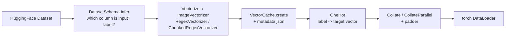

# 3. The data layer

Source: `src/vectormesh/data/` — `vectorizers.py`, `cache.py`, `schema.py`, `dataset.py`.



---

## 3.1 `BaseVectorizer` — the contract

Every vectorizer is a frozen pydantic model (`Cachable`) with four fields and two obligations.

| Field | Meaning |
|---|---|
| `model_name` | identifies the producing model; stored in metadata as `model_tag` |
| `input_col` | which dataset column to **read** from (`"text"`, `"image"`, …) |
| `col_name` | which dataset column to **write** into |
| `device` | `cuda` / `mps` / `cpu`, auto-detected by `detect_device()` |

Obligations:

1. `initialize_model()` — a pydantic `@model_validator(mode="after")`, so it runs on
   construction. Must set `self._metadata` (with a `hidden_size`) and `self._effective_max_length`
   (the real context limit, or `None` when the concept doesn't apply).
2. `__call__(inputs: list, batchsize: int) -> dict[str, list[Tensor]]` — returns
   `{self.col_name: [tensor_per_item, ...]}`, **accurately annotated** (see
   [§2.7](02-tensor-contracts.md#27-the-one-place-types-are-read-as-data)).

Exposed read-only properties: `get_metadata`, `get_hidden_size`, `get_context_size`.

`fingerprint_fields()` describes the vectorizer to the cache (see
[§3.6](#what-create-does)). It already covers every public field, so most vectorizers need
nothing; override it when a field is not JSON-serialisable (a `Callable`) or when *private*
state changes the output, and list fields that mutate during vectorization in
`FINGERPRINT_EXCLUDE`.

The split between `input_col` and `col_name` is what makes the same cache pipeline work for
text, images and regex features without any branching in `VectorCache`.

---

## 3.2 `Vectorizer` — text, chunked

Wraps any HuggingFace `AutoModel` + `AutoTokenizer`. Output: **one `(chunks, dim)` matrix per
document**.

```python
vectorizer = Vectorizer(
    model_name="ibm-granite/granite-embedding-small-english-r2",
    col_name="granite",
    max_length=512,       # cap the context window; None = model maximum
)
```

Four internal steps, each individually shape-annotated and worth reading as a unit:

| Method | Shape transform | What it does |
|---|---|---|
| `tokenize` | `list[str]` → `(B·chunks, tokens)` ×2 + `(B·chunks,)` | overflow-tokenizes; returns `input_ids`, `attention_mask`, and `overflow_to_sample_mapping` (which document each chunk came from) |
| `embed` | `(B·chunks, tokens)` → `(B·chunks, tokens, dim)` | runs the encoder in sub-batches of `batchsize` under `no_grad` |
| `aggregate` | `(B·chunks, tokens, dim)` → `(B·chunks, dim)` | **masked** mean over the token axis; padding tokens excluded |
| `extend` | `(B·chunks, dim)` → `list[(chunks, dim)]` | regroups chunks per document using the overflow mapping; also tallies `chunk_sizes` |

### Chunking parameters

- `_effective_max_length = min(model_max_positions, max_length)`. Big context windows (8192)
  are usually a RAM problem, not a quality win — hence the explicit cap.
- `_stride = _effective_max_length // STRIDE_DIVISOR` (i.e. 10% overlap between consecutive
  chunks, so a sentence straddling a boundary is not lost).
- Both are written into the cache metadata (`context_size`, `stride`) so the chunking is
  **reproducible** by other tools.

### Why mean-pool over tokens?

Self-attention has already mixed information across the whole window, so each token vector is
a holographic-ish view of the chunk. The mean is a cheap, robust summary. It is a defensible
default, not the only choice — CLS pooling and attention pooling are reasonable exercises.

---

## 3.3 `ImageVectorizer` — vision, one vector per image

Wraps `AutoImageProcessor` + `AutoModel`. Output: **one `(dim,)` vector per image**
(`tensordtype == 1`), so downstream it behaves exactly like the regex path: no padder needed,
just `torch.stack`.

```python
vectorizer = ImageVectorizer(
    model_name="facebook/dinov2-small",
    input_col=schema.input_col,     # e.g. "image" or "img"
)                                   # col_name defaults to "embed"
```

Two details that make it model-agnostic:

- **`_pool`** — uses `pooler_output` when present, flattening trailing spatial dims
  (ResNet gives `(b, dim, 1, 1)`, ViT gives `(b, dim)`). Otherwise falls back to
  `last_hidden_state`: mean over the token axis for rank-3 ViT output, over the spatial axes
  for rank-4 CNN output.
- **`_probe_dim`** — runs one dummy 224×224 forward pass to discover the embedding dimension,
  rather than trusting config keys that differ per architecture (`hidden_size` vs
  `hidden_sizes`). Whatever `_pool` returns *is* the dimension, by construction.

### The "LOAD REPORT … UNEXPECTED" message

Loading a classification checkpoint via `AutoModel` prints e.g.:

```
classifier.bias   | UNEXPECTED |
classifier.weight | UNEXPECTED |
```

This is the **desired** outcome, not an error: `AutoModel` builds the backbone with no task
head, so the checkpoint's ImageNet classifier weights have nowhere to go. We want the backbone
vector and not the 1000-class head.

- `UNEXPECTED` → benign: weights in the file we deliberately don't use.
- `MISSING` → the alarming one: backbone weights *not* found, meaning part of the model is
  randomly initialised.

Silence it with `from transformers.utils import logging as hf_logging;
hf_logging.set_verbosity_error()`.

`__call__` chunks its input list into `batchsize`-sized batches, so passing more images than
`batchsize` is fine: `tests/test_image_vectorizer.py` covers the multi-batch path against a
stubbed processor/model, without downloading weights.

---

## 3.4 `RegexVectorizer` — hand-written features

Output: **one binary `(n_features,)` vector per document**. Interpretable, fast, and a useful
counterweight to the black-box embedding — a good vehicle for teaching that "features" and
"embeddings" are the same kind of object once they are vectors.

```python
regexvectorizer = RegexVectorizer(
    pattern_builder=build_imdb_review_pattern,
    harmonizer=harmonize_imdb_match,
    min_doc_frequency=15,
    max_features=200,
    training_texts=train["text"],     # fitting happens on construction
)
```

### The two-function protocol

- **`pattern_builder() -> re.Pattern`** — returns the compiled regex. Its capture groups define
  what a "match" looks like.
- **`harmonizer(match) -> str`** — collapses a raw match into a canonical feature name, so that
  `"artikel 7:2 Burgerlijk Wetboek"` and `"artikel 7:2 BW"` become the same feature.

Two pairs ship with the library:

| Domain | Builder | Harmonizer | Example feature |
|---|---|---|---|
| Dutch legal deeds | `build_legal_reference_pattern` | `harmonize_legal_reference` | `"7:2 BW"` |
| IMDB reviews | `build_imdb_review_pattern` | `harmonize_imdb_match` | `"terrible"` |

### Fitting

`fit(texts)` counts every harmonized match, then selects the vocabulary in two passes:

1. keep patterns appearing in at least `min_doc_frequency` **documents** (drops noise);
2. of those, keep the top `max_features` by **total frequency**.

The resulting count becomes `hidden_size` — so a `max_features=200` vectorizer that only finds
43 surviving patterns reports `hidden_size=43`. Always read the fitted size from
`get_hidden_size` or the metadata; never assume `max_features`.

`print_stats(top_k=20)` shows the most common patterns and a bar chart — use it to sanity-check
that your regex is matching what you think it matches before spending a caching run on it.

---

## 3.5 `ChunkedRegexVectorizer` — regex features aligned to embedding chunks

Subclass of `RegexVectorizer` that emits a **`(chunks, n_features)` matrix** whose row *i*
corresponds to chunk *i* of an embedding produced by a `Vectorizer`. That alignment is what lets
you concatenate the two per chunk (`Concatenate3D`) instead of only at the document level.

```python
vectorizer = ChunkedRegexVectorizer(
    col_name="chunked_regex",
    tokenizer_name=meta["model_tag"],      # from the embedding cache's metadata
    context_size=meta["context_size"],
    stride=meta["stride"],
    pattern_builder=build_legal_reference_pattern,
    harmonizer=harmonize_legal_reference,
    training_texts=traincache["text"],
)
```

**The alignment contract:** chunk boundaries are fully determined by the triple
`(tokenizer_name, context_size, stride)`. Pass the values recorded in the embedding cache's
metadata and the chunk counts are guaranteed identical — no stride logic is re-derived
anywhere.

Mechanically: only the *tokenizer* is loaded (no model weights). Chunking happens in token
space; `offset_mapping` maps each chunk back to a character span, and the regexes run on that
raw substring.

**Fast-tokenizer requirement.** `offset_mapping` only exists on Rust (fast) tokenizers. If the
tokenizer is not fast, the vectorizer does not crash — it warns, falls back to one
whole-document chunk per text (still a rank-2 `(1, n_features)` tensor so the cache schema is
unchanged), and records `offsets_supported: false` in the metadata. **Check that flag** before
trusting per-chunk alignment.

---

## 3.6 `VectorCache`

```python
cache = VectorCache.create(
    cache_dir=Path("artefacts"),
    vectorizer=vectorizer,
    dataset=dataset,
    dataset_tag="imdb",
    remove_columns=["image"],     # optional: drop raw pixels from the cache
)
cache = VectorCache.load(path=Path("artefacts/20260605_imdb_granite"))
```

### What `create` does

| Step | Method | Notes |
|---|---|---|
| resolve output column | `_resolve_column` | explicit `column_name` wins, else `vectorizer.col_name` |
| build the on-disk schema | `get_features` + `get_dtensor` | rank read from the `__call__` annotation → `Sequence(Value)` for 1D, `Sequence(Sequence(Value))` for 2D |
| run the model | `_vectorize` | `dataset.map(..., batched=True)`, reading `vectorizer.input_col` |
| name the map's cache file | `_map_fingerprint` | hashes dataset fingerprint + `vectorizer.fingerprint_fields()` + schema + batch sizes |
| assemble metadata | `_build_metadata` | version, model tag, vectorizer class, rank, dims, context/stride, chunk histogram |
| merge with existing | `update_metadata` | looks in `cache_dir/dataset_tag/metadata.json` and merges — this is how caches *extend* |
| persist | `_write` | `save_to_disk` + `metadata.json` |

On failure the partially written directory is removed (`shutil.rmtree`) and the original error
is re-raised wrapped in `VectorMeshError`.

The output folder is named `{timestamp}_{dataset_tag}_{column_name}`, so successive extensions
are visible and orderable on disk.

### Why `create` computes its own fingerprint

`datasets.map` normally fingerprints a call by pickle-hashing the mapped function — and that
function closes over the vectorizer, so hashing it serialises the entire torch model. The cost
is flat: ~21s per `create`, whether you vectorize 250 images or 2000. Passing an explicit
`new_fingerprint` skips that hashing and leaves only the real encoder throughput.

The fingerprint names the arrow file `map` reuses, so it has to be deterministic (otherwise
nothing is ever reused) *and* sensitive to everything that changes the output (otherwise a
stale result is served silently, which is far worse than a slow one). That is why it is built
from `vectorizer.fingerprint_fields()` rather than from `model_name` alone: two
`RegexVectorizer`s fitted on different corpora share a `model_name`, a class and a
`hidden_size`, but produce different feature columns.

### Extending a cache

This is the workflow in `notebooks/0_vectorizer.ipynb` and `2_design.ipynb`:

```python
updated = VectorCache.create(
    cache_dir=Path("tmp/artefacts"),
    vectorizer=regexvectorizer,        # a different vectorizer
    dataset=vectorcache.dataset,       # the dataset that already has the embeddings
    dataset_tag=existing_folder.name,  # merges that folder's metadata.json
)
```

The embedding column is carried through untouched; a new column is appended; the metadata now
describes both. **The vectors are never recomputed.**

### Reading a cache

`VectorCache` proxies to the underlying `datasets.Dataset` via `__getattr__`, `__getitem__`,
`__len__` and `__iter__`, so `cache.select(...)`, `cache.map(...)`, `cache["text"]`,
`cache.features` and `cache[0]` all work directly. The dataset is set to
`set_format(type="torch")`, so items come out as tensors.

### `metadata.json`

```jsonc
{
  "granite-embedding-small-english-r2": {
    "vectormesh_version": "0.3.0",
    "model_tag": "ibm-granite/granite-embedding-small-english-r2",
    "vectorizer_type": "Vectorizer",
    "tensordtype": 2,              // per-document rank: 2 => (chunks, dim)
    "hidden_size": 384,
    "context_size": 512,
    "stride": 51,
    "offsets_supported": null,
    "chunk_sizes": {"1": 58, "2": 4, "3": 2}
  },
  "features": ["text", "label", "granite-embedding-small-english-r2"],
  "created_at": "2026-06-06T10:03:17",
  "num_observations": 64
}
```

`chunk_sizes` is a histogram of documents-per-chunk-count — read it to pick `max_chunks` for
`FixedPadding` instead of guessing.

---

## 3.7 `DatasetSchema` — column-name inference

HuggingFace datasets disagree about names: input in `text` / `sentence` / `image` / `img`,
label in `label` / `labels` / `target` / `category`. `DatasetSchema` resolves that once.

```python
schema = DatasetSchema.infer(dataset["train"])
schema = DatasetSchema.infer(dataset["train"], label_col="fine_label")   # pin an override
```

Resolution order per role: **explicit override → alias list (case-insensitive, ordered by
priority) → feature type** (a string `Value` for the input, a `ClassLabel` for the label).

An unresolvable input column raises `VectorMeshError` with a `hint` and a `fix`; a missing
label only warns, since inference-only datasets are legitimate.

Feed the result straight into the parameters the rest of the library already takes:

```python
vectorizer = ImageVectorizer(model_name=m, input_col=schema.input_col)
onehot     = OneHot(num_classes=n, label_col=schema.label_col, target_col="onehot")
```

This is what makes notebook 4's dataset catalog work: switching from `flowers` to `eurosat`
changes one string and nothing else.

---

## 3.8 Targets and batching

### `OneHot`

```python
onehot = OneHot(num_classes=32, label_col="labels", target_col="onehot")
train_oh = train.map(onehot)
```

Turns a sparse integer label (or list of labels) into a dense float vector. Multi-label works
because `vec[observation[label_col]] = 1.0` accepts a list index — that is why the legal task,
where a deed can carry several legal facts, uses `BCEWithLogitsLoss` rather than
`CrossEntropyLoss`.

### `Collate`

```python
collate_fn = Collate(
    embedding_col="legal_dutch",
    target_col="onehot",
    padder=FixedPadding(max_chunks=30),
)
```

Gathers one column of per-document tensors, pushes them through `padder`, stacks the targets.
Returns `(X, y)`.

For **1D** vector columns (image, plain regex) there is nothing to pad — pass
`padder=torch.stack`.

### `CollateParallel`

```python
collate_fn = CollateParallel(
    vec1_col="legal_dutch",
    vec2_col="regex",
    target_col="onehot",
    padder=FixedPadding(max_chunks=30),
    padder2=None,                        # 1D vec2 -> just stacked
)
```

Returns `((X1, X2), y)` — a tuple input, which is exactly what `Parallel` consumes.

`padder2` is the switch between the two fusion styles:

| `vec2` column | `padder2` | Result | Fuse with |
|---|---|---|---|
| 1D per document (`RegexVectorizer`) | `None` | `X2` is `(batch, dim2)` | `Concatenate2D` after aggregation |
| 2D per document (`ChunkedRegexVectorizer`) | a padder with the **same** `max_chunks` | `X2` is `(batch, chunks, dim2)` | `Concatenate3D` before aggregation |

---

## 3.9 Dataset construction helpers

`dataset.py` also holds the instructor-side tooling that produced the distributed caches:

- **`LabelEncoder`** — maps sparse domain codes (`504`, `579`, …) to dense indices `1..N`,
  reserving index `0` for unknown. `onehot`, `encode`, `decode(vector, threshold)`, plus
  `save`/`from_file` so the mapping travels with the data.
- **`aktes_threshold(file_path, threshold)`** — reads a JSONL corpus, drops labels occurring
  fewer than `threshold` times, and drops documents left with no labels.
- **`generate_splits(...)` / `build(...)`** — train/valid/test split, label encoding, and
  `save_to_disk` into `aktes_theshold_{threshold}_{fingerprint}/`.

```python
build(
    input_file=Path("assets/data.jsonl"),
    threshold=50,
    trainsplit=0.8,
    testvalsplit=0.5,
    output_dir=Path("assets/"),
)
```

Students normally receive the output of this step rather than running it.

Next: [Components](04-components.md).
