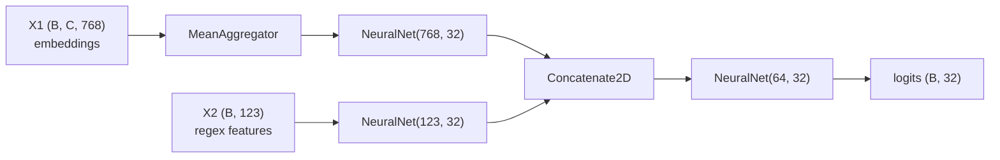
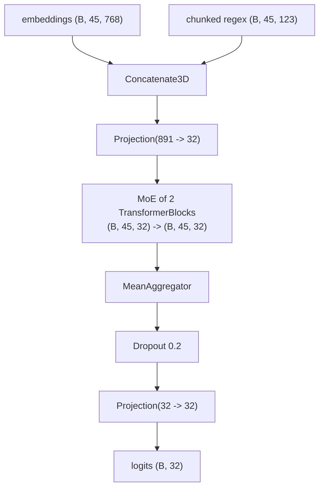

# 5. Architectures

Composition patterns, ordered by how much machinery they need. Each one is a working pipeline;
the shapes in the comments are the contract that makes it type-check.

---

## 5.1 The baseline: aggregate, then classify

```python
pipeline = Serial([
    MaskedMeanAggregator(),                    # (B, C, 768) -> (B, 768)
    NeuralNet(hidden_size=768, out_size=32),   # (B, 768)    -> (B, 32)
])
```

Two lines, no learnable aggregation. This is the number every other architecture has to beat,
and it is often surprisingly hard to beat — a strong frozen encoder plus a mean is a solid
baseline. Establish it first.

Swapping `MaskedMeanAggregator` for `AttentionAggregator(768)` or `RNNAggregator(768)` is the
cheapest possible ablation: one word changed, one training run.

---

## 5.2 Parallel fusion at document level

Two representations of the same document — a dense embedding and a sparse interpretable feature
vector — fused after each is reduced to `(B, D)`.



```python
parallel = Parallel([
    Serial([MeanAggregator(), NeuralNet(hidden_size=768, out_size=32)]),
    Serial([NeuralNet(hidden_size=123, out_size=32)]),
])

pipeline = Serial([
    parallel,          # (X1, X2)              -> ((B, 32), (B, 32))
    Concatenate2D(),   # ((B, 32), (B, 32))    -> (B, 64)
    NeuralNet(hidden_size=64, out_size=32),
])
```

Data side:

```python
collate_fn = CollateParallel(
    vec1_col="legal_dutch", vec2_col="regex",
    target_col="onehot", padder=FixedPadding(max_chunks=30),
)   # padder2=None: the regex column is 1D per document
```

The `123` is the fitted regex feature count — read it from
`cache.metadata["regex"]["hidden_size"]` rather than hardcoding, because it changes with
`min_doc_frequency` and `max_features`.

**Design question this raises:** each branch is squeezed to 32 dimensions *before* fusion. Is
that bottleneck helping (regularisation, balanced contribution) or destroying signal? Try fusing
the raw widths and projecting after.

---

## 5.3 Adding a residual path

```python
pipeline = Serial([
    parallel,
    Concatenate2D(),                                  # (B, 64)
    Projection(hidden_size=64, out_size=32),          # (B, 32)
    Skip(transform=NeuralNet(hidden_size=32, out_size=32), in_size=32),
])
```

`Skip` pre-norms, applies the transform, and adds the input back. Depth becomes safe to add: the
identity path means an unhelpful block can be learned toward zero rather than degrading the
signal.

Gating variants on the same slot:

```python
# a gate inside the residual branch
Skip(
    transform=Serial([NeuralNet(32, 32), Gate(hidden_size=32)]),
    in_size=32,
)

# learned routing around the transform entirely
Highway(transform=NeuralNet(hidden_size=768, out_size=768), hidden_size=768)
```

The progression `Skip → Gate → Highway → MoE` is the same idea at increasing resolution: one
unconditional add, one learned per-dimension scale, one learned two-way interpolation, one
learned N-way mixture.

---

## 5.4 Mixture of experts

```python
moe = MoE(
    experts=[NeuralNet(hidden_size=768, out_size=32) for _ in range(4)],
    hidden_size=768,
    out_size=32,
)
pipeline = Serial([MaskedMeanAggregator(), moe])
```

Every expert sees every input; the router's softmax decides the blend. With rank-2 input there is
one routing decision per document.

What to actually look at when you train this:

- Do the router weights differentiate at all, or does it collapse to a uniform blend (in which
  case the MoE is an expensive ensemble average)?
- Does specialisation correlate with anything semantic — document length, label group?
- Does 4 experts of width 768 beat 1 expert of width 3072? (Same parameter budget, different
  structure. This is the honest comparison.)

Because the implementation is dense, the compute cost scales linearly with expert count. The
sparse top-k routing from the Shazeer paper in `references/` is the extension that makes it
scale — and getting it to train stably (load balancing, noisy gating) is a substantial project
in its own right.

---

## 5.5 Chunk-level fusion with an MoE transformer

The most involved pipeline in the repo (`scripts/train_moe_parallel.py`). Instead of fusing two
representations *after* aggregation, it fuses them **per chunk**, so every expert sees the regex
signal belonging to that specific chunk.



```python
moe = MoE(
    experts=[TransformerBlock(HIDDEN_SIZE, num_heads=2) for _ in range(2)],
    hidden_size=HIDDEN_SIZE,
    out_size=HIDDEN_SIZE,
)

pipeline = Serial([
    Concatenate3D(),                          # (X1, X2) -> (B, C, emb + regex)
    Projection(fused_dim, HIDDEN_SIZE),       #          -> (B, C, 32)
    moe,                                      #          -> (B, C, 32)   per-chunk routing
    MeanAggregator(),                         #          -> (B, 32)
    torch.nn.Dropout(0.2),
    Projection(HIDDEN_SIZE, NUM_CLASSES),     #          -> (B, 32) logits
])
```

Two prerequisites, both structural:

1. The regex column must come from a **`ChunkedRegexVectorizer`** built with the embedding
   cache's own `(model_tag, context_size, stride)` — otherwise row *i* of the regex matrix does
   not describe chunk *i* of the embedding. See
   [§3.5](03-data-layer.md#35-chunkedregexvectorizer--regex-features-aligned-to-embedding-chunks).
2. **Both** padders in `CollateParallel` must use the same `max_chunks`, or `Concatenate3D`
   cannot align them.

Note that this pipeline takes a tuple as input without a `Parallel` in front — `Concatenate3D`
consumes the tuple directly, because neither branch needs its own preprocessing here.

**Why the plain `MeanAggregator` here, and not the masked one?** This is a subtle and instructive
point. `MaskedMeanAggregator` detects padding by looking for all-zero rows — but by the time the
tensor reaches the aggregator, the `TransformerBlock` has already destroyed that signature. Its
pre-norm `LayerNorm` maps an all-zero row to its own `bias`, and the attention output at that
position is a weighted sum over the *valid* keys, so the residual `x + attn_out` is non-zero even
where `x` was zero. Swapping in `MaskedMeanAggregator` at this position is a **no-op** — it finds
nothing to mask.

The block does still respect padding where it counts: `_pad_mask` keeps padded positions from
being attended *to*. What leaks is their contribution as *queries*, into the mean.

If you want that closed properly, the mask has to be captured from the input (before the MoE) and
re-applied afterwards — which means threading a mask through the pipeline, a design change rather
than a component swap. Worth attempting as an exercise; measure whether it moves the metric before
committing to the complexity.

---

## 5.6 The image path

Image embeddings are 1D per item, so there is no chunk axis and no padder at all:

```python
collate_fn = Collate(embedding_col="embed", target_col="onehot", padder=torch.stack)

pipeline = Serial([
    GaussianNoise(sigma=0.1),                             # train-only augmentation
    NeuralNet(hidden_size=hidden_size, out_size=n_classes),
])
```

This is a **linear probe** (well, a two-layer probe) on frozen vision features. It is the
cleanest possible demonstration of the embed-once thesis: swapping `mobilenet_v2` for
`dinov2_small` changes only the caching step, and the accuracy difference you see afterwards is
attributable purely to representation quality.

---

## 5.7 Choosing a pattern

| Situation | Reach for |
|---|---|
| One vector column, get a baseline | `Serial([MaskedMeanAggregator(), NeuralNet(...)])` |
| Suspect only some chunks matter | swap in `AttentionAggregator` |
| Chunk order is meaningful | `RNNAggregator`, or `TransformerBlock` before aggregation |
| Two document-level representations | `Parallel` + `Concatenate2D` |
| Two chunk-level representations | `Concatenate3D` before aggregation (needs aligned chunking) |
| Want depth without instability | wrap blocks in `Skip` |
| Want the model to learn *whether* to transform | `Highway` |
| Want specialisation across inputs | `MoE` |
| Small training set, frozen features | add `GaussianNoise` in front of the head |

Next: [Training](06-training.md).
