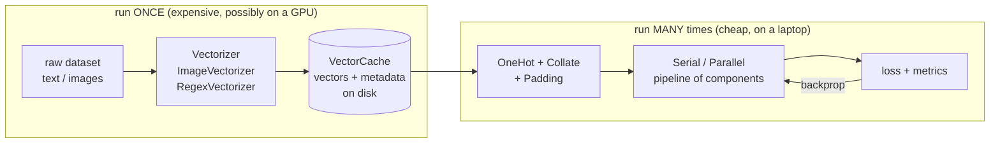

# VectorMesh documentation

VectorMesh is a framework for **embed once, reuse many times**.

A large pretrained encoder (a BERT-family text model, a vision CNN/ViT, or a hand-written
regex feature extractor) is run over a dataset exactly once, by whoever has the hardware and
the judgement to pick it. The resulting vectors are written to disk as a `VectorCache` — a
versioned, documented artefact. Everything after that — architecture design, gating, mixtures
of experts, hyperparameter search — trains a *small* head on those frozen vectors, cheaply
enough to run on a laptop CPU.

The library exists to make the second half of that sentence composable: a set of small,
shape-checked `nn.Module` blocks that snap together into pipelines, so "what if I fuse these
two representations here?" is a three-line change and a one-minute training run, not an
afternoon.

---

## Reading order

| # | Document | What it covers |
|---|---|---|
| 1 | [Core concepts](01-core-concepts.md) | The embed-once economics, thinking at the vector level, the 1D/2D/3D tensor-flow ladder |
| 2 | [Tensor contracts](02-tensor-contracts.md) | Shapes as a type system: jaxtyping + beartype, reading shape errors |
| 3 | [The data layer](03-data-layer.md) | Vectorizers, `VectorCache`, metadata, `DatasetSchema`, `OneHot`/`Collate` |
| 4 | [Components](04-components.md) | Every building block: padding, aggregation, neural, connectors, gating, augmentation |
| 5 | [Architectures](05-architectures.md) | Composing the blocks: serial, parallel fusion, skip/highway, MoE, chunk-aligned fusion |
| 6 | [Training](06-training.md) | Metrics, loss choice, `mltrainer` wiring, the batch scripts |
| 7 | [API reference](07-api-reference.md) | Compact signature tables for everything exported |
| 8 | [Teaching path](08-teaching-path.md) | Notebook-by-notebook course map, the questions each one is meant to provoke |

If you are **starting out**: read [Core concepts](01-core-concepts.md), then run
`notebooks/1_training.ipynb`, then keep [Components](04-components.md) open as a lookup table.

If you are **building a cache for others to use**: [The data layer](03-data-layer.md) is the
contract you are publishing.

If you are **extending the library**: [Tensor contracts](02-tensor-contracts.md) and
[The data layer](03-data-layer.md) describe the two invariants that everything else relies on.

---

## The shape of the whole system



The dashed line between the two halves is the whole point: the cache is a **hard boundary**.
Nothing to the right of it can change the encoder, and nothing to the left of it is repeated
per epoch.

---

## Package layout

```
src/vectormesh/
├── __init__.py            # top-level exports: VectorCache, Vectorizer, ImageVectorizer, ...
├── types.py               # VectorMeshError, Cachable, BaseComponent, TensorInput
├── data/
│   ├── vectorizers.py     # Vectorizer, ImageVectorizer, RegexVectorizer,
│   │                      # ChunkedRegexVectorizer + regex pattern builders
│   ├── cache.py           # VectorCache: create / load / extend, metadata handling
│   ├── schema.py          # DatasetSchema: infer input/label column names
│   └── dataset.py         # OneHot, Collate, CollateParallel, LabelEncoder, build()
└── components/
    ├── pipelines.py       # Serial, Parallel
    ├── padding.py         # FixedPadding, DynamicPadding
    ├── aggregation.py     # Mean / MaskedMean / Attention / RNN aggregators (3D -> 2D)
    ├── neural.py          # NeuralNet, Projection, Attention, TransformerBlock
    ├── connectors.py      # Concatenate2D, Concatenate3D, Stack2D
    ├── gating.py          # Skip, Gate, Highway, MoE
    ├── augmentation.py    # GaussianNoise (feature-space augmentation)
    └── metrics.py         # Accuracy, F1Score, MAE, MASE
```

Plus, outside the package:

- `notebooks/` — the taught material, in order (`0_vectorizer` → `4_image_vectorizer`)
- `scripts/` — batch versions of the notebooks, for long runs on real hardware
- `references/` — the source papers (Highway Networks, Outrageously Large Neural Networks,
  and two category-theory books that motivate the composition style)
- `tests/` — unit + integration tests (`pytest -m "not integration"` to skip model downloads)
